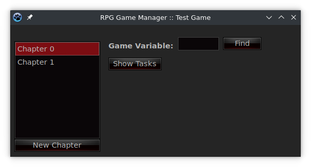
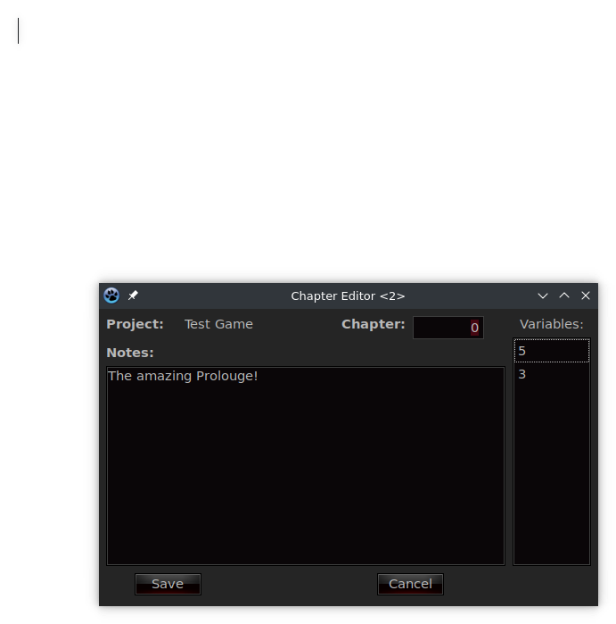
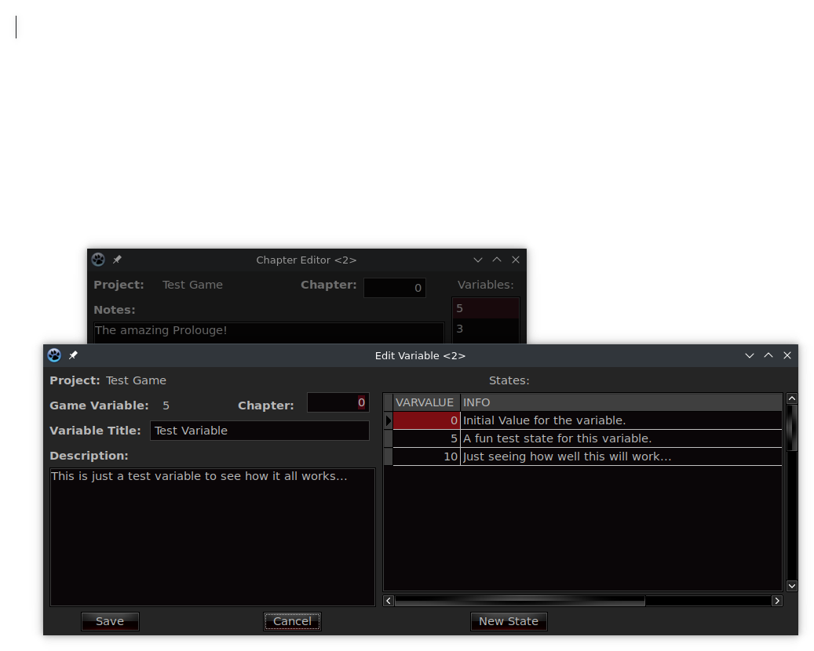
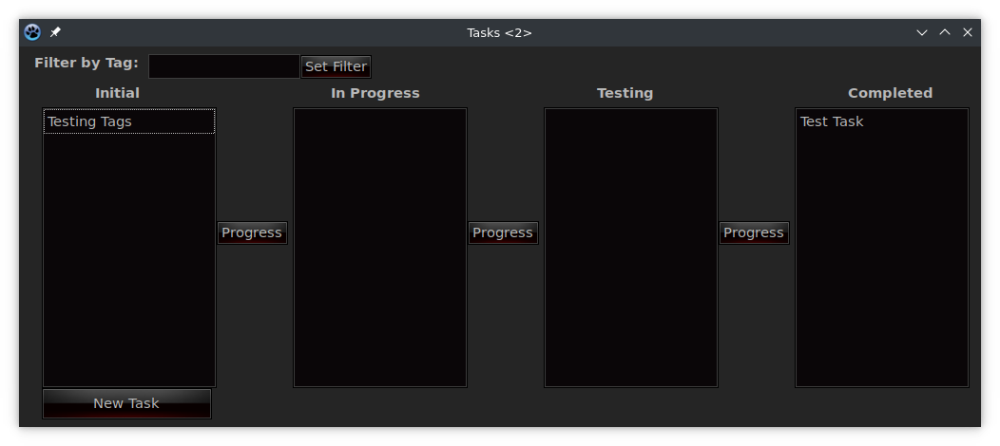

# RPG Game Development Manager

Currently very primitive and basic, for my own personal purposes, it gets the job done.  It includes a fully working Kanban board, with a basic single tagging system, allowing various tasks to be filtered via a simple tag.

Here is the current list of features:

  * Can Manage Multiple Game Projects
  * Can Manage a very basic chapter-based story
  * Can Manage state variables, along with what each state does in-game
  * Variables can be easily looked up via it's in-engine number
  * Variables can be assigned to a specific game chapter, allowing all chapter variables to be viewed
  * A working, but basic Kanban board with tasks

## Screenshots

